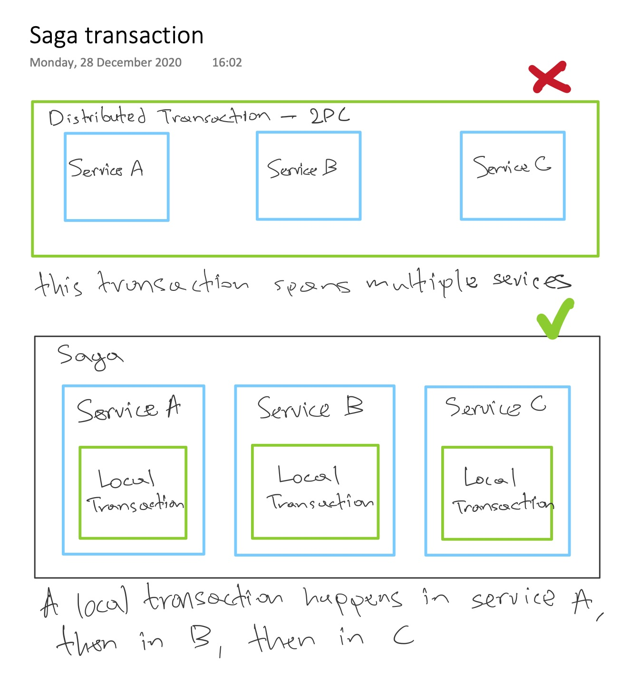
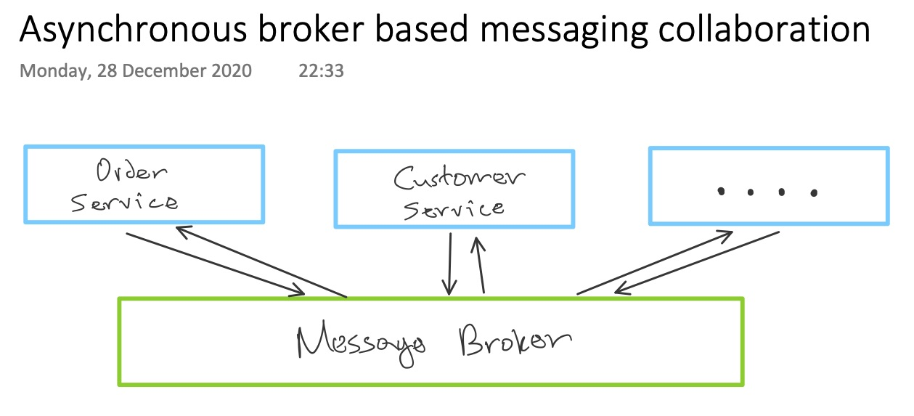
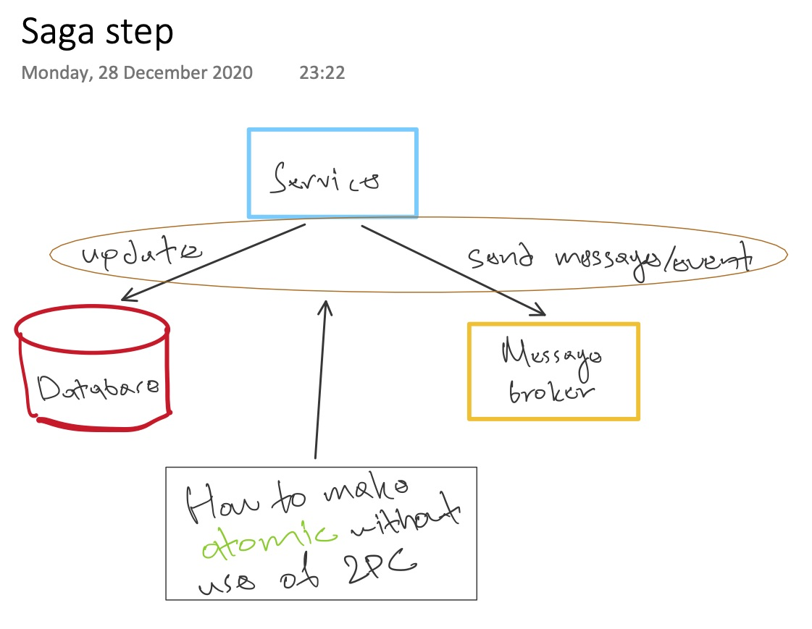
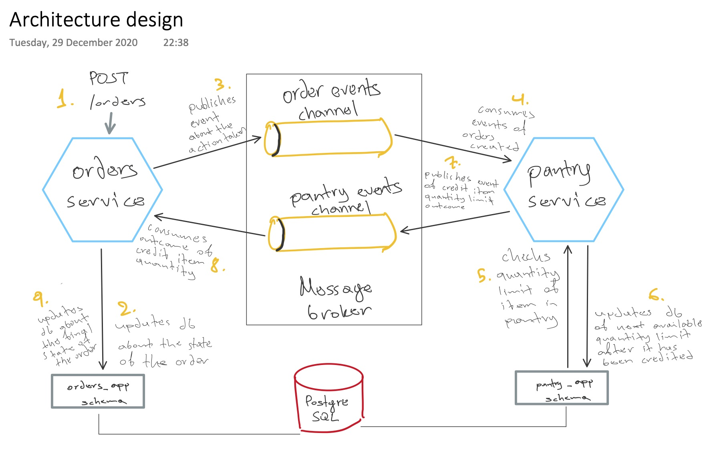
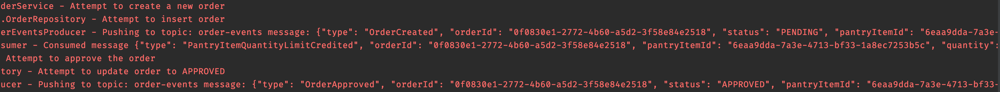
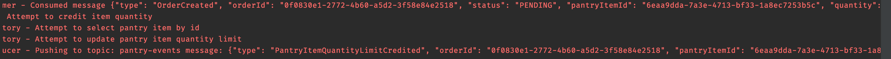

## Background

### Well, where to begin...
***Saga*** is a flow of transactions that updates each service and
publishes a message to trigger then next transaction step. This pattern
is not something new. It came from a paper back in **1987**

On a very high level, ***Saga*** does not use a ***distributed transaction***;
it breaks down the transaction into a series of local transactions in each
one of the participating services.



Now that ***microservices*** architecture is more frequent when orchestrating
a system, plain `http request/response` communication between microservices can be hard 
to maintain. In fact, it increases *coupling*, because both of the services
need to be *available* at that specific moment for a flow to happen.
They're bound to the *request/response* model.

### Saga design challenges

#### API design
Although, a saga internally uses asynchronous communication, the very first step
that starts the saga might be triggered synchronously, via an ***http request*** like so
```http request
POST /orders
```
So now we have to cover the issue of *when* we send back the response.

#### Implementing rollbacks
In a ***distributed transaction*** you can execute a `rollback` statement
that undoes all the updates that have been made so far. But in a saga, given
that we have ***local transactions*** in the services required to execute
a flow; if one of the steps fails, the steps required before that have already
committed their changes into their local databases. So we have to explicitly
undo all that.

#### Lacking the Isolation property in ACID -- ACD
The execution of steps of one saga can interleave with the execution of
steps of other sagas. That may increase database anomalies such as: ***dirty reads***, etc.
So we must use countermeasures such as ***semantic logging***, which means
the `state` of the `Order` is `PENDING` until it becomes `APPROVED` or `REJECTED`.

### Saga participants communication
As mentioned above, synchronous communication, such as ***REST***, introduces
***temporal coupling***, because both client and server need to be available.

So in sagas it makes more sense to be implemented using
***asynchronous broker-based messaging collaboration*** where the participants
communicate through a message broker; that gives us at least once guarantee delivery.



If we have those properties, means that even if a saga participant becomes
unavailable, the message broker is going to keep retrying the delivery of
that message until the other participant will process it. That guarantees
the saga will ***eventually*** run to completion.

#### Saga step
In such fashion, a saga step is a transaction local to a service.
- Service executes a transaction that updates its database
- And will also send a message or publish an event

That will trigger the next participant in the saga to execute its own
local transaction. 

>*The interesting thing here is how to make those actions
in a saga step ***atomically*** by not using a ***distributed transaction***.*



### Saga patterns
A ***Saga*** is a sequence of transactions, right? And, mentioned earlier,
we saw that communication between those transactions are based upon events.
So the next thought that comes to mind is that, there should be some logic
somewhere that knows what saga step is executed after another 
-- either a failed or a successful step.

Here are the two saga patterns based on ***decision-making*** aspect:
 - Choreography: ***distributed*** decision-making
 - Orchestration: ***centralized*** decision-making

More details about them [here](https://microservices.io/patterns/data/saga.html) :point_left:

### Putting a stop here
Well this post is not supposed to discuss all the implementation details
and challenges on how to implement sagas. It would be a book to do that,
and there are out there already!

## My demo app
I wanted to try to implement a saga on my own, using as much ***lightweight***
libraries as I could -- to have more control and get more knowledge.

So the concept is similar to ***orders-and-customers***. The idea is that you
want to order a ***pantry_item*** for which you've put a quantity limit. For example,
you can't have more than 4 pieces of broccoli in your pantry at home.

In that fashion, we have:
 - orders
 - pantry

**Orders** is the service where you can create/update orders about **pantry_items**

**Pantry** is the service that manages if an order about a specific **pantry_item**
has exceeded its limit or not.



### Logs

As seen in the design picture above, the saga starts with a typical
http request to *create a new order* The correct way to read the logs is
to take a look at the ***pantry logs*** after reading the in the ***orders logs***
```
"Pushing to tpic: order-events message: {...}"
```
After ***orders*** publishes a message about the order creation, that's where
***pantry*** starts its lifecycle, consuming that message.

#### Orders service



#### Pantry service



Below we see the logs of the ***

### Github Repo

My demo ***orchestration saga*** is :point_down:
```
https://github.com/pagidas/kotlin-kafka-choreography-saga
```

I put as much effort as I could to implement it without using heavyweight frameworks.
So it's all out there, explicitly, from the ***kafka consumers/producers***, basic
***jdbc*** for ***postgresql***, up to simple ***web controllers***. The only fancy bit
might be the use of ***Kotlin*** which I find myself playing around with lately.

I think my demo app, along with the talk I'm referencing down below, could be a great start to
get your hands in ***sagas*** and their challenges

That's it, folks, I hope you enjoyed!

## References

It's all here! [click me!](https://www.youtube.com/watch?v=kyNL7yCvQQc)

An in-depth talk about ***asynchronous microservices*** by *Chris Richardson*

