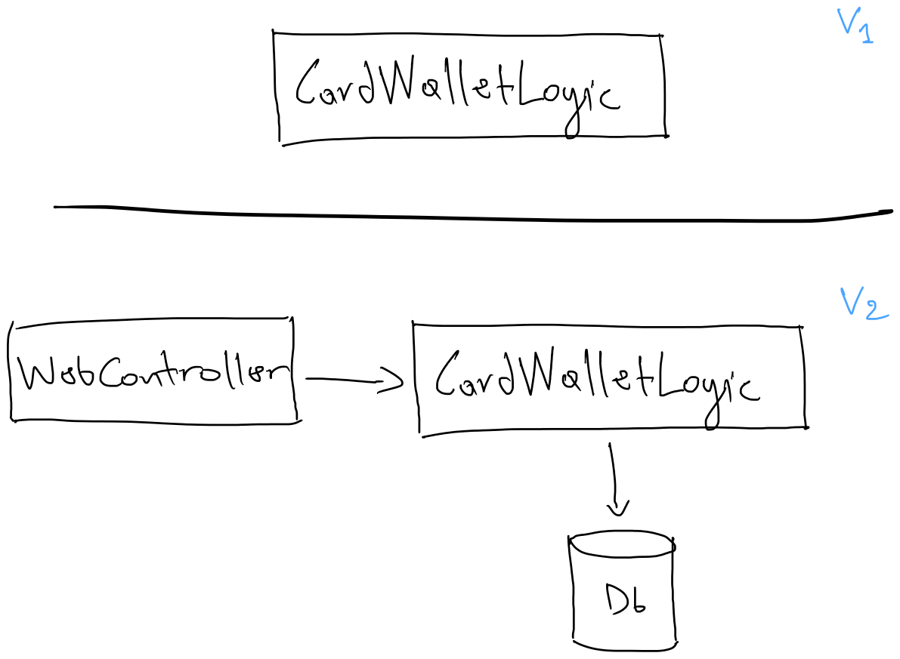
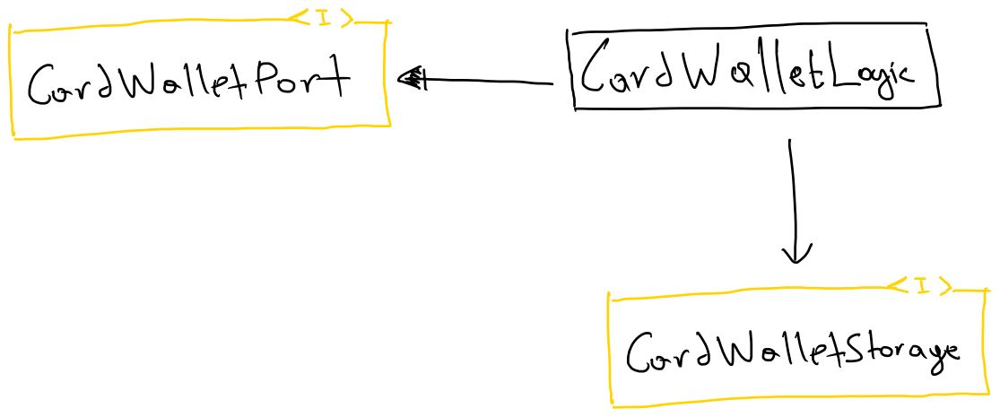
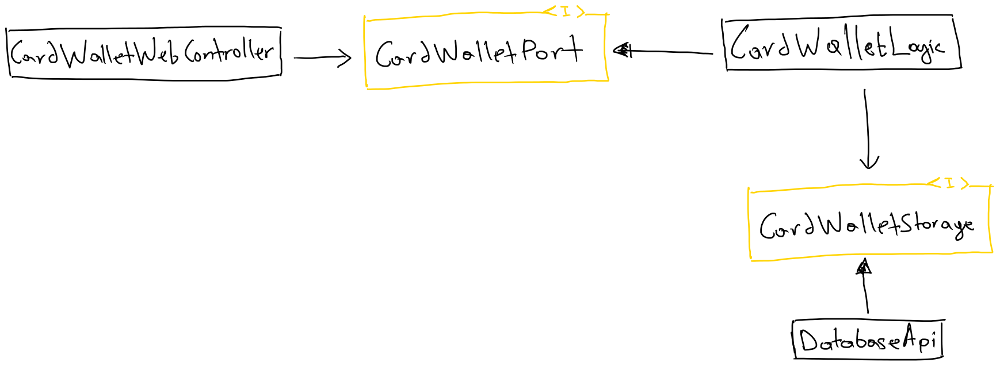
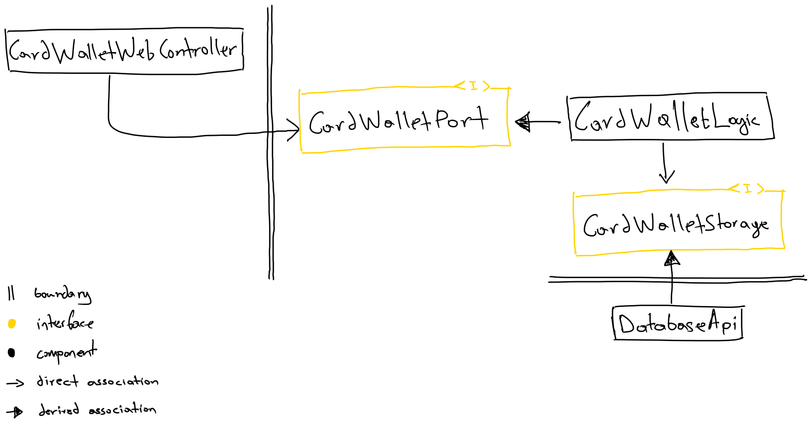

So it all began when I moved to another team within the same company.
This colleague of mine, when I asked him how the team was like, etc, he said
to me in the end, "we use the hexagonal architecture here, and you'll see
how much power it gives you." Back then, I knew little about the 
[**_SOLID_**](https://en.wikipedia.org/wiki/SOLID) principles, which 
is an acronym about best practices in OOP, heavily promoted by
[Uncle Bob](http://cleancoder.com/products). 
Not a long later, I found out how all of these so-called 
best practices were mentioned back in the 1970s.

The ports and adapters pattern is an architectural pattern invented by
[Alistair Cockburn](https://alistair.cockburn.us/coming-soon/); 
you can read all about it [here](https://alistair.cockburn.us/hexagonal-architecture/) :point_left:
It aims at creating loosely coupled application components, that can fix
undesired dependencies, and domain logic leaking into the user interface 
and vice-versa.

## Glossary
**_Hexagon_** is our core domain logic that should be isolated from
the outside world. It should ideally contain no technology-specific
dependencies; only very lightweight libraries that help with the complexity
of the domain.

**_Ports_** are the interfaces defined, with their respective models,
to separate the application components.

**_Adapters_** are the components that adapt the technology to the interface (port).

There are at two types of ports, as well as adapters.
 - **_Driving_** ports: interfaces defining how the application is triggered. 
 - **_Driven_** ports: interfaces defining how the application communicates with 
the external world.

In the above fashion, the same goes with the driving/driven adapters

In a nutshell, we have our **_hexagon_** (domain logic) component which 
we want to isolate from the outside world via well-defined **_ports_** (interfaces),
which are then implemented/used by **_adapter_** components.

> _Note that the above statement does not encompass all, so make sure you read 
  the link to the original pattern if questions arise._

## How it relates to SOLID
The ports and adapters pattern enforces one the **_SOLID_** principles due
to its glossary. **_Dependency Inversion_** principle, which states

> _High-level modules should not depend on low-level modules; both should
depend on abstractions. Abstractions should not depend on details; details
should depend on abstractions._

One thing to clarify is that the dependency direction is not affected when
applying the above principle; but, because of introducing an abstraction between them,
we end up with two different dependencies.
- the high-level module depends on the abstraction.
- the low-level module depends on **_that same_** abstraction.

The dependency inversion principle follows naturally when we
apply **_Open/closed_** and the **_Liskov substitution_** principles.

The **_Open/closed_** principle requires a software component to be open for
extension and closed for modification. We can achieve that by introducing an
abstraction for which we can derive different components. An interface itself
is closed for modification, but we can extend it by providing new implementations.

Our implementations on the above principle should follow the **_Liskov substitution_**
principle so that we can replace implementations of an abstraction without
affecting the behaviour of the application. We can verify this principle when
our tests exercise the **_behaviour_** and not implementation details.

## Building an application
Let's try and build an application to understand more about the pattern.
The theme of the application will be a sort of card wallet software, which can:
- create a wallet
- list all wallets
- add a pass*
- debit a pass*

`Pass`* - a pass for this example is like those club cards in a super-market containing points.

### Design phase

My initial attempt to draw out the application ended up quite ineffective, but we are here
to learn, so I will include them in order to express my thoughts.



Now for "architectural design" **_V1_**, there is not really _any_ architecture.
Not only that but I stared at it confusingly, thinking of what will be my next steps, 
until I had reached to a point where I started adding things that became my **_V2_**.

I see this **_WebController_** that makes me think that there is some kind of web
technology that is associated to the **_CardWalletLogic_**. Ok, maybe it _uses_
the logic component. So this is probably an HTTP component that when called
it uses the logic component, which is supposed to be our main application. Then
we have another thing there, **_DB_** which is _used_ by our **_CardWalletLogic_**,
reading/writing data to complete the functionality.

**_V2_** seems to be like an architectural design, but the thing that bothers me
is that out of my confusion, I took technology decisions, only because of my
inability to continue on designing the application. I also had thoughts on
how would I test this out; I would need an HTTP server running, 
or I would mock it out; have a db up and running, or again mock it out.
All in all, I felt I did not have a design that would help me start coding.

With a bit more focus on the ports and adapters pattern, I came up with the next
version of the design.



Trying to make sense of the pattern, I drew two interfaces 
(ports in the glossary of the pattern)
 - `CardWalletPort` - driving port.
 - `CardWalletStorage` - driven port.

One that defines how to communicate with the card wallet domain component, 
and one that the domain _uses_ to finish the functionality. 
That leaves us with `CardWalletLogic` to be an implementation detail, 
which is _derived_ from the interface that defines the shape of 
the domain logic component(the hexagon).

> _For those who do not know already, the filled arrow is a derived association 
(extends) and the empty arrow is a direct association (uses, has, etc.)._

With this design, I felt much more confident. It also reminded me that 
regardless of what things are out of both interfaces (ports) 
I could safely - and I ought to - start implementing the behaviour 
of the card wallet domain first.

But I did not, yet! 

My curiosity of my previous mistakes wanted me to 
try and visualize the design with both the abstractions and the technology
choices I made in the last version.



It took a bit of time to draw out the correct associations, but I made it.
- `CardWalletWebController` - driving adapter.
- `DatabaseApi` - driven adapter.

`CardWalletWebController` wraps the card wallet domain component 
via the port, which means it _has an instance_ of that interface, 
and adapts HTTP-specific things to it. This is called an adapter
in the ports and adapters pattern, because it uses the 
_adapter software design pattern_. Simple, right?
The other adapter is the `DatabaseApi` which derives from the 
dependency port of card wallet domain component, adapting domain
logic into database-specific, acting as the depepdency port itself.

Another thing that I struggled to grasp is that the pattern talks about
_loosely coupled application components that stop undesired dependencies,
and contamination of domain logic into the user interface and vice-versa_. 
From my last version of the design, I could definitely see the "loosely coupling"
being introduced because of the abstractions in place (ports). What I could not
clearly depict, was the _components_. There was no clear separation of components,
i.e. component modularity.



In the (hopefully) last design version, I attempted to clearly
place the boundaries so that I could understand the dependencies.
The design depicts three components:
- the card wallet domain component (hexagon)
- the HTTP adapter component (driving adapter)
- the database adapter component (driven adapter)

These three components should ideally be three separate modules with their 
own local concerns and dependencies. The design implies that whatever
changes may happen to adapter modules will not affect the domain module (hexagon).
This information is understood by the arrowed lines that, crossing the boundaries,
they point to the same direction, to the most important part of the system.
The domain logic. The high-level module, card wallet domain, does not directly 
depend on the low-level modules, the adapters, but on abstractions.
Also, the low-level modules do not directly depend on the high-level module's
implementation details, but on the domain api.

### Coding phase

Let us start by defining the port responsible to talk to our domain component.

We will focus on the wallet creation capability of the application; but
we can pair it with the list all wallets functionality so that we can test
the behaviour solely via the interface.

```kotlin
interface CardWalletPort {
    fun createWallet(walletHolder: String): Wallet
    fun list(): List<Wallet>
}

class CardWalletLogicTest {

    private val cardWallet: CardWalletPort = TODO()

    @Test
    fun `can create a wallet`() {
        val created = cardWallet.createWallet("John Doe")

        val wallets = cardWallet.list()

        assertThat(wallets, equalTo(listOf(created)))
    }
}
```

If we remember the ports and adapters pattern, it defines:
- driving ports/adapters
- driven ports/adapters

The test we wrote in the above block of code, is essentially a
**_driving adapter_**; it drives/triggers the domain logic component. 
It is "driving" because it targets the driving port, and "adapter" because it 
asserts the interface is behaving correctly, by running the framework's rules 
engine upon results when delegating calls to the interface.

Now that we have defined the functionality in the port and a :boom: failing test 
ready to go; let us start implementing the hexagon.

```kotlin
class CardWalletLogic(
  private val cardWalletStorage: CardWalletStorage): CardWalletPort {
  
    override fun createWallet(walletHolder: String): Wallet =
        WalletDomain.empty(UUID.randomUUID(), walletHolder)
            .toDto()
            .also { newWallet -> cardWalletStorage.save(newWallet) }

    override fun list(): List<Wallet> = cardWalletStorage.getAll()
}

interface CardWalletStorage {
  fun save(wallet: Wallet): Wallet
  fun getAll(): List<Wallet>
}
```
> _For simplicity, internals of `CardWalletLogic` are not included in the demo
(there will be a link to the GitHub repository)_

For creating a wallet, we have decided to persist the results into some storage;
and so we define a driven port as it is an external concern.

`toDto()` function maps the domain object's model to a data transfer model. This
is crucial, so we do not end up leaking domain knowledge out of the hexagon.
If we have a rich domain, and we choose to spread it across domain
objects, those models must not be part of the api (driving or driven ports), 
rather they should be implementation details of the very hexagon. 
That leaves us using simple data structures for entering or exiting the hexagon.

Of course, we now need to verify that the domain logic we have coded complies
with the test we have written in the beginning. The test exercises the behaviour 
of the wallet creation functionality.

```kotlin
class CardWalletLogicTest {

    private val cardWallet: CardWalletPort =
      CardWalletLogic(InMemoryCardWalletStorage())

    @Test
    fun `can create a wallet`() {
        val created = cardWallet.createWallet("John Doe")

        val wallets = cardWallet.list()

        assertThat(wallets, equalTo(listOf(created)))
    }
}
```

Our test is green :white_check_mark: :tada:

Because at this point we are just focusing on the business domain, we have added an
in-memory storage implementation, `InMemoryCardWalletStorage`, for the driven port.

Now it is simply a matter of implementing all the rest of capabilities our 
domain application is supposed to do.

**_TDD intensifies..._**

**_fast-forward some time later..._**

```kotlin
class CardWalletLogicTest() {

    private val cardWallet: CardWalletPort = 
        CardWalletLogic(InMemoryCardWalletStorage())
  
    @Test
    fun `can create a wallet`() {
        val created = cardWallet.createWallet("John Doe")

        val wallets = cardWallet.list()

        assertThat(wallets, equalTo(listOf(created)))
    }

    @Test
    fun `can add a pass to a wallet`() {
        val wallet = cardWallet.createWallet("John Doe")
        val newPass = PassBuilder().build()

        val updatedWallet = cardWallet.addPass(wallet.id, newPass)
        val foundPass = updatedWallet.passes.find { it.id == newPass.id }

        assertThat(foundPass, equalTo(newPass))
    }

    @Test
    fun `can get wallet by id`() {
        val existed = cardWallet.createWallet("John Doe")

        val found = cardWallet.getWalletById(existed.id)

        assertThat(found, equalTo(existed))
    }

    @Test
    fun `can debit pass points`() {
        val pass = PassBuilder(points = 70).build()
        val wallet = cardWallet.createWallet("John Doe")
            .run { cardWallet.addPass(id, pass) }

        val result =  cardWallet.debitPass(wallet.id, pass.id, 50)

        assertThat((result.get() as Pass).points, equalTo(20))
    }

    @Test
    fun `can not debit more than balance`() {
        val pass = PassBuilder(points = 50).build()
        val wallet = cardWallet.createWallet("John Doe")
            .run { cardWallet.addPass(id, pass) }

        val result =  cardWallet.debitPass(wallet.id, pass.id, 51)

        val error = WalletErrorBuilder.ofPass(pass)
            .withNotEnoughPointsIssue(debitAmount = 51, balance = 50)
            .build()
        assertThat(result.get() as WalletError, equalTo(error))
    }

    @Test
    fun `can not debit pass when not found`() { 
      val wallet = cardWallet.createWallet("John Doe")
      val pass = PassBuilder(points = 50).build()
    
      val result = cardWallet.debitPass(wallet.id, pass.id, 50)
    
      val error = WalletErrorBuilder.ofPass(pass)
          .withPassNotFoundIssue()
          .build()
      assertThat(result.get() as WalletError, equalTo(error))
    }
}
```

We have managed to build all the card wallet domain application functionalities,
with a mixture of happy and unhappy path scenarios passing :white_check_mark: :tada:

Implementing the rest of the modules (driving and driven adapters) are not demonstrated
since the essence of this demo is to focus on the domain first of all.

### Testing strategy

Since the architectural pattern guides as in terms of putting the right abstractions
in place; we can extend this even to our testing approach. We can define the test
suite as another abstraction that implementors (driving/driven adapters in our case)
can construct the system under test (SUT) in whatever ways, exercising that with the
given adapting technologies the api still behaves as it supposed to be.

Let us have an example of the test suite extended like mentioned above.

```kotlin
abstract class CardWalletContract {

    abstract val cardWallet: CardWalletPort
  
    @Test
    fun `can create a wallet`() {...}
  
    @Test
    fun `can add a pass to a wallet`() {...}

    @Test
    fun `can get wallet by id`() {...}

    @Test
    fun `can debit pass points`() {...}

    @Test
    fun `can not debit more than balance`() {...}

    @Test
    fun `can not debit pass when not found`() {...} 
}
```

Now our previous logic test looks like this.

```kotlin
class CardWalletLogicTest: CardWalletContract() {
  
    override val cardWallet: CardWalletPort = 
        CardWalletLogic(InMemoryCardWalletStorage())
}
```

The component responsible for the HTTP adapter would ideally need to
comply with the contract test (the abstract test suite) we defined above.

```kotlin
class CardWalletHttpTest: CardWalletContract() {

    private val httpServer: Http4kServer = 
        CardWalletWebController(InMemoryCardWallet())
          .withFilter(ServerFilters.CatchLensFailure())
          .asServer(SunHttp(0))

    override val cardWallet: CardWalletPort =
        CardWalletHttpClientFactory
          .ofUri("http://localhost:${httpServer.port()}")

    @BeforeEach
    fun setUp() {
        httpServer.start()
    }

    @AfterEach
    fun tearDown() {
        httpServer.stop()
    }
}
```

>*The `InMemoryCardWallet` is a quick way to construct the logic
against an in-memory storage.*

There is an idea behind making sure to test the behaviour of an api
rather than its implementation details due to their nature of changing
more frequently. The move value we add to that single test suite, the 
more important it becomes to make sure all adapters comply with it.

Here's a [link](https://github.com/pagidas/ports-and-adapters-demo) to project's repository on Github.

Hope you enjoyed :smile:

