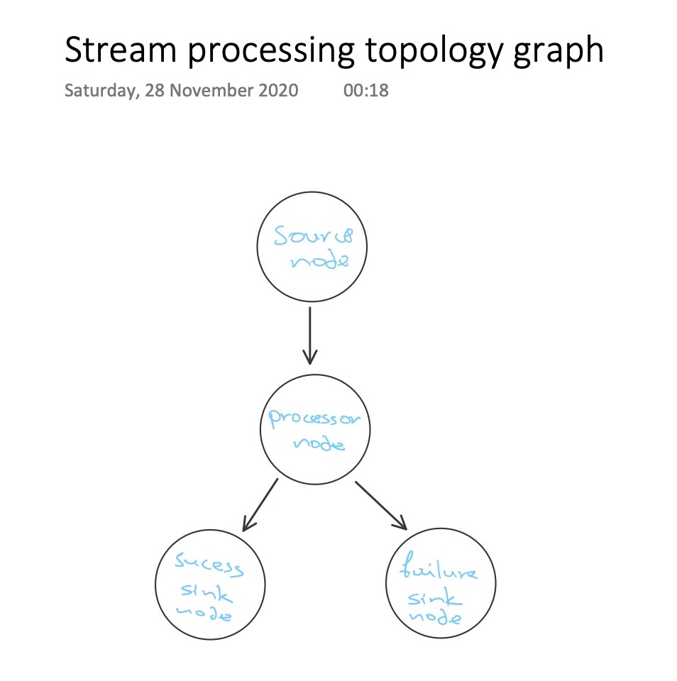
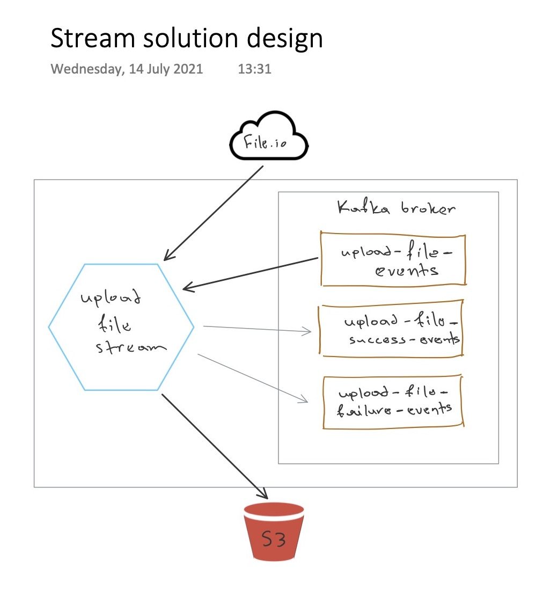
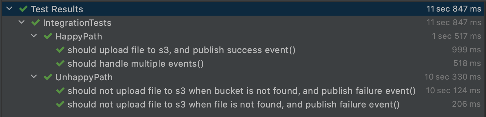

### Lately...
Not a new thing, but lately I've been trying to focus more on testing the behaviour of an
application rather than its implementation details. Those details are variable; so our
behavioural test (Integration test?) shouldn't depend on them.

For example if our application exposes a RESTful CRUD api, storing the resource into
some database -- changing the library used to connect to the database and run queries at it,
must not change the fact that our application should still behave the same.

I'm not a fan of *mocking* external dependencies into my tests, especially if the application
is heavy on them. I prefer a "test through the wire", one that does a real connection.

It feels like a `docker-compose` context would be perfect for such testing... 

I hope you know this already, but if you don't, there is a very interesting library 
wrapping ***Docker*** commands, which we can use to set our environment with docker containers
ready for our testing. And all that programmatically within our test source code.
And, yes, of course I'm talking about [Testcontainers](link)

### My Demo app
For the sake of this blog post, the demo application I've designed has
a variety of dependencies that makes it a bit hard to test overall.

On a high level, we have a ***streaming application*** that processes events
about files which we need to download from an external api, and then save them
into an ***AWS S3*** bucket.

The technology I used for the application above is [Kafka](https://kafka.apache.org/),
and specifically I used the [Processor API](https://kafka.apache.org/10/documentation/streams/developer-guide/processor-api.html)
to create a ***processor topology*** to represent my business logic.

For demoing purposes, the external api from which I download the file to continue the flow,
I used the [file.io](https://www.file.io/) -- in reality it could be any third-party provider.

#### Topology graph
Our ***topology graph*** looks like this


Quite simple, right?

In code, the DSL describing the above topology is even simpler, once you get
your hands around ***Kafka***

```kotlin
KafkaStreams(StreamsBuilder().build().run {

            addSource(SOURCE_NODE,
                LongDeserializer(),
                UploadFileEventDeserializer(),
                UploadFileEvent.topic)

            addProcessor(PROCESSOR_NODE,
                ProcessorSupplier { UploadFileEventProcessor(fileIOApi, s3Config, s3) },
                SOURCE_NODE)

            addSink(SINK_SUCCESS_NODE,
                UploadFileSuccessEvent.topic,
                LongSerializer(),
                UploadFileEventBaseSerializer(),
                PROCESSOR_NODE)

            addSink(SINK_FAILURE_NODE,
                UploadFileFailureEvent.topic,
                LongSerializer(),
                UploadFileEventBaseSerializer(),
                PROCESSOR_NODE)
    
    }, this.kafkaConfig.toProperties())
```

Our business logic lives into this `UploadFileEventProcessor` instantiated by ***Kafka's*** `ProcessorSupplier`.

#### Solution diagram


#### Setting up Testcontainers
First is our gradle imports, and ***Testcontainers*** thankfully provides us with a ***bom*** we can use,
so we can have the same version across all libraries for no conflicts.

```kotlin
implementation platform("org.testcontainers:testcontainers-bom:$testContainersVersion")
testImplementation "org.testcontainers:kafka"
testImplementation "org.testcontainers:mockserver"
```
They do also provide specific containers of widely used technologies to abstract the way we spin them up.

As seen above `org.testcontainers:kafka` and `org.testcontainers:mockserver`.

For other containers that there is no specific module, we can of course use the `GenericContainer`
which works as expected, the same way you'd create and run an instance of a docker container.

There are two ways we can use ***Testcontainers*** functionality: 

1) We can let the library handle the containers' lifecycle
2) Or we can control it manually.

For the automated containers' lifecycle control, we have to import another module:
```kotlin
testImplementation "org.testcontainers:junit-jupiter:$junit5Version"
```
This adds some annotations where we can use to declare containers that are maintained by the library -- `@Container`.

In our own example I use the manual approach to have singleton containers.
You can read more about the ***JUnit5 support*** [here](https://www.testcontainers.org/test_framework_integration/junit_5/) :point_left:

To setup singleton containers with manual lifecycle control, we have to follow a ***base class*** pattern:
```kotlin
open class TestContainersBase {
    companion object {
        // declare your containers...
        
        init {
            // start your containers
            // plus whatever is needed for the context to load properly
        }
    }
}
```

Note how we declare containers that are supported by the framework, and also containers using the `GenericContainer` type.
```kotlin
private val kafkaContainer = KafkaContainer(DockerImageName.parse("confluentinc/cp-kafka:5.4.3")).apply { 
    withExposedPorts(KAFKA_CONTAINER_PORT)
}
private val mockServerContainer = MockServerContainer(DockerImageName.parse("mockserver/mockserver")).apply {
    withExposedPorts(MOCK_SERVER_CONTAINER_PORT)
}
private val s3MockContainer = GenericContainer<Nothing>(DockerImageName.parse("adobe/s3mock")).apply {
    withExposedPorts(S3_MOCK_CONTAINER_PORT)
    withEnv("initialBuckets", "file-uploads")
}
```
To test that we upload to ***AWS S3*** I used [S3Mock](https://github.com/adobe/S3Mock)
but we could use [LocalStack](https://github.com/localstack/localstack). 

Similarly, to test we download the file
from a third-party api, I used [MockServer](https://www.mock-server.com/) but another good alternative is [Wiremock](http://wiremock.org/).
Both of those solutions we can add pairs of `request/response` expectations, which sounds like *mocking*, yet it isn't.
They both run a real `http` server.

Our `init {}` would simply look like this:
```kotlin
init {
    // init containers
    kafkaContainer.start()
    mockServerContainer.start()
    s3MockContainer.start()
}
```

Now you may wonder how do we connect to those docker containers when they are started...

We already exposed the ports when we declared the containers in the example up above, but those are not the ports that are actually mapped 
into our `localhost`. Rather, ***Testcontainers*** actually exposes them on random free ones to avoid port collisions.

At runtime, we can ask ***Testcontainers*** what is the actual mapped port given the port of the container we declared, like so:
```kotlin
s3MockContainer.getMappedPort(S3_MOCK_CONTAINER_PORT)
```

As soon as we have the `host` and `port` that our docker containers run at, the only thing we are left
to do is just pass them into our application's config via environment, so we can start testing the behaviour
of our application.



### Github repo
The demo application is located here :point_down:

```
https://github.com/
```

